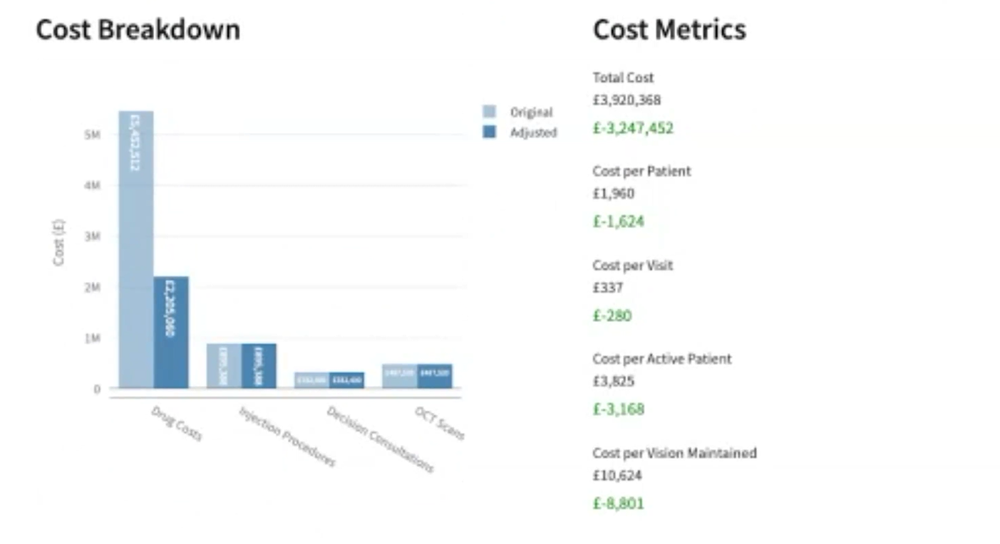
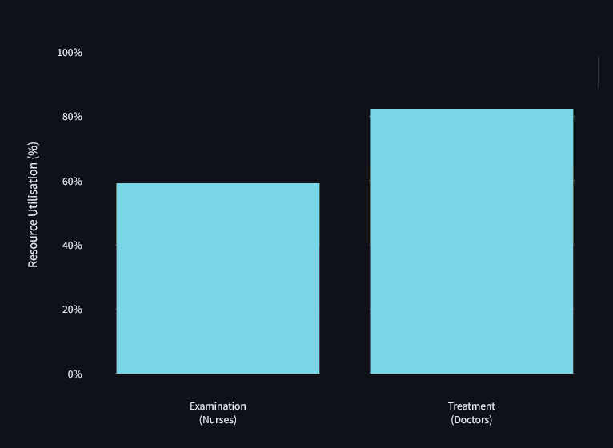
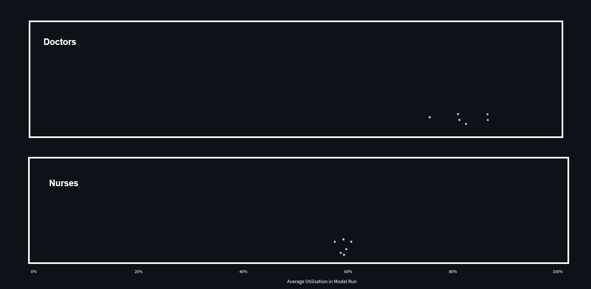
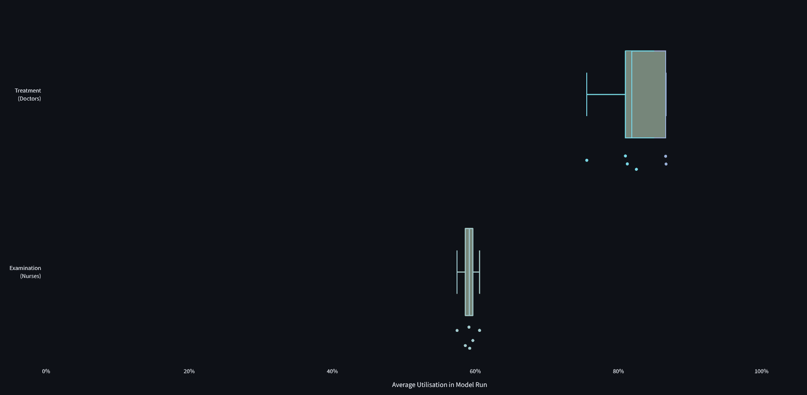
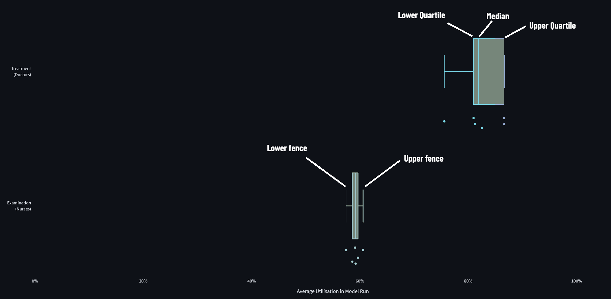
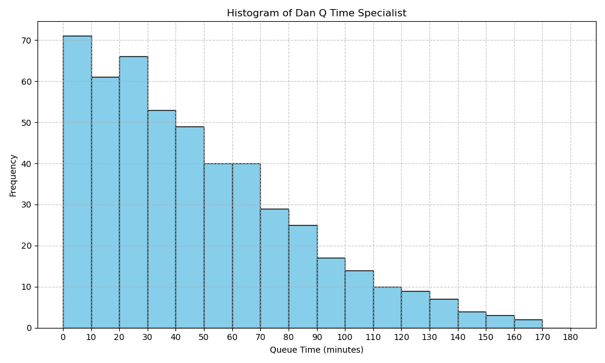
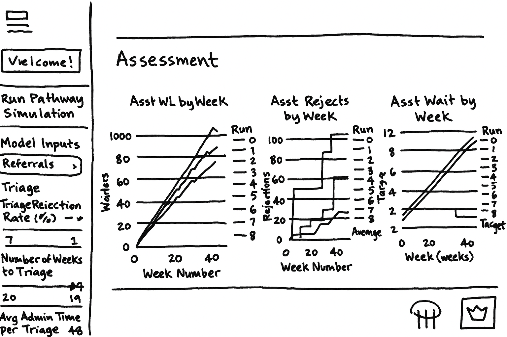
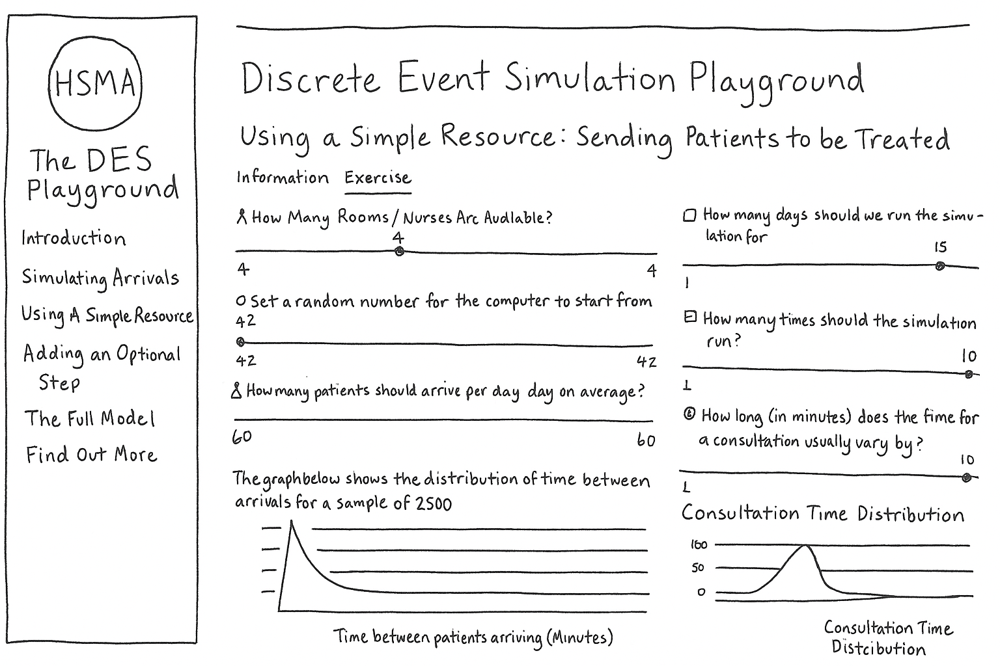

```{python}
#| echo: false

from vidigi.logging import EventLogger
from vidigi.utils import EventPosition, create_event_position_df
from vidigi.animation import animate_activity_log, generate_animation
from vidigi.prep import reshape_for_animations, generate_animation_df
import simpy
import numpy as np

import plotly.io as pio
pio.renderers.default = "notebook"
```

# Recap

So far we've talked about the different parts of a discrete event simulation.

But what if we could actually see the simulation panning out?

Let's revisit the key concepts.

## {#animationdemo-entities data-menu-title="Entities"}

Entities arrive in your system at varying rates

Entities are often the service users in your model.

Like buses, you might have none arrive for ages, then several at once.

```{python}
#| echo: false

```

## {#animationdemo-generators data-menu-title="Generators"}

Generators bring entities into being, and sinks take entities out of being.

And we might have multiple generators for different kinds of patients, if they arrive at different rates.

```{python}
#| echo: false

```


## {#animationdemo-entitypaths data-menu-title="Entity Paths"}

Our entities might take a range of different routes through the system.

```{python}
#| echo: false

```

## {#animationdemo-queueing data-menu-title="Queueing and Prioritisation"}

Queues might be seen in the order they arrive - or you may use priority-based queueing.

```{python}
#| echo: false

```

# The Power of Animations

We've demonstrated a few simple animations here to help recap the concepts.

Each animation is actually a **real discrete event simulation** running under the hood, using real simulation code.

But these animations aren't just limited to toy examples - they can be applied to real simulations too!

:::{.notes}
- Animations are valuable for communication, allowing non-experts to intuitively understand what is going on
- they are also valuable for verifying that the simulation is running correctly
:::

## From an emergency department...

```{python}
#| echo: false

```

:::{.notes}
Mention that here we are also showing having multiple different resource pools

Don't have much in the way of queues here because this simulation is also reflecting the variation in arrivals at different times of day

Drag it through to about 6am and see the queues building up

And talk about how this gives us ability to very quickly see
:::

## To a ward...

```{python}
#| echo: false

```

:::{.notes}
- Building more complex animations where we can track additional measures simulataneously with the visuals

So here we have an elective surgery specialty with a number of ringfenced beds. Patients come in for their knee or hip surgery

if no bed is available, their surgery will be cancelled

- here the line is representing the number of slots lost each day

- we can start to get a sense of how it's got this weekly cycle of the beds clearing out over the weekend, so surgeries on Mondays and Tuesdays tend to be fine, but then later in the week you start to see some surgeries being cancelled.

And here we're even tracking the length of stay of individual patients and whether they are delayed
:::

# What-if Scenarios

:::{.notes}
So now we've got all the parts of our DES

We've starting to see some of the ways we could visualise our queues and our flow - though there are a lot more we will discuss later

So what can we actually do with this? We can start exploring some different 'what-if' questions in our simulation.
:::

## The Power of Questions

There are some key kinds of questions you can ask using a DES:

What happens if

:::: {.columns}

::: {.column width='48%'}

:::{.incremental}
- we **add** or **remove** resources?
  - at certain times of day?
  - or if we change the timing and overlap of different shifts?
- **demand increases** or **decreases**?
  - from certain patient subgroups?
- patient characteristics **change**?
:::


:::

::: {.column width='48%'}

:::{.incremental}
- we **reorder** or **change** the process?
- parts of the process get **faster** or **slower**?
- we change how the queue is **prioritised**?
- we **change operating hours**
:::

:::

::::

:::{.notes}
### Resources

- Will adding staff help? It looks like there's too much capacity in one part of the system, but does removing it cause problems? Or flip it around and start asking how many resources we need to meet a certain performance target.
- then we can start to look at it at a more granular level

### Demand and patient characteristics

- can start to predict how well the service will cope with predicted demand changes
- and can make this more granular if you know that e.g. stroke patients are predicted to rise more than cardiac arrests
- or maybe it's slightly different - maybe you know sicker patients have longer LOS, and you know you have an aging population

### Process reordering and extra steps

- also great for seeing if process change ideas might be a way to tackle system issues without having to actually set those changes up

- or maybe you need to add something new into the process, like an extra kind of scan - what impact will that have on where your queues build up?

- What about the optimum level of resourcing for that step?

### Queue prioritisation

- Maybe you want to explore benefits and downsides of different ways of prioritisation, or ringfencing a certain amount of resource for the most urgent cases

### Operating hours

- changing the hours a service is running for
- for example you run something like an SDEC for 12 hours - what's the impact of running that longer? Or a HEMS service that doesn't run 24 hours a day?
- (which can sometimes be quite interesting from a data perspective - you need a way of capturing that demand)
:::


## And animations can help you understand the answer to your questions!


:::{.notes}
- On the left, have one resource
- On the right, have two
- Having two isn't solving our queuing problem - but it is
:::

# Other DES Outputs

:::{.column width="90%"}

Animations can help you understand what's going on - but they're not so good at summarising the answers to your what-if questions.

What else might we track?

:::

:::{.notes}
If you're going to run 10 different scenarios, it's not easy to summarise the animations.

And you can't print an animation in a report!

And while they might be nice for helping us to understand flow and bottlenecks, they're not the only things we might want to pull out of a simulation.

So what else is available to us?
:::

## Wait Times

:::{.column width="98%"}

A common thing to measure is the **wait time** for key points in the service.

:::{.incremental}
- The **mean average** wait time
- The **median average** wait time
- The **maximum** wait time
- The **variation** in wait times
:::

:::{.fragment}
You might also subset this by time (like the hour or day), or across different patient types
:::

:::

:::{.notes}

Mean average = add up how long every person waited, and divide it by the total number of waits

Can be very affected by unusually long or short waits

Median average - give everyone a clipboard where they record how long they waited, then ask themselves to put themselves in a line based on their wait times, shortest to longest.

Then I walk up to the person in the middle of that line, and ask how long they waited.

Not as affected by outliers.

Maximum wait is important - those extreme values could be otherwise masked.

Variation in wait time - and I'll talk more about how you'd measure that later. But it's important to understand if there's a lot of variation, or not much, and how much variation varies across scenarios.

And it might

:::

## Discussion

That gives you one idea for what you might measure in a model.

But what other sorts of things might you want to be tracking and discussing?

**Discuss in your groups for 5 minutes**, and then we'll share some ideas.


## Meeting wait *targets*

:::{.columns width="90%"}

Rather than looking purely at the raw wait times, we might be interested in meeting targets.

For example:

- what % of people waited more than 4 hours?
- what % of cases met the 2 week wait target?

:::

## Queue Lengths

We might also be interested in

- the average lengths of queues
- how queues vary across
  - different resources/parts of the process
  - different times of day/days of the week/months of the year


:::{.notes}
Recap runs
:::

## Resource Utilisation

We may also be interested in **resource utilisation**.

If our waits are good, but most of the time our resources are sitting idle, this is not optimal...

**But what is the ideal level of resource utilisation? Shout out your thoughts.**

:::{.fragment}

We often don't want all our resources being utilised 100% of the time - they'll burn out! Or if we have a ward, we might not want it running at 100% occupancy so that there's space for emergency admissions.

In fact, depending on your ward size and how important it is that a bed is immediately available, optimum occupancy could be as low as ~55%.

There's a great paper [here](https://pubmed.ncbi.nlm.nih.gov/34219171/) if you'd like to find out more!

:::

:::{.notes}
Talk a bit here about variability - the impact of not having spare capacity in your ward when someone then arrives needing seeing urgently

And how this can vary with different ward sizes, what the impact of a bed *not* being available, etc.

"Research using computer simulation finds that the ideal occupancy depends on ward size, specialty, and tolerance for capacity breaches. For example, a typical 25-bed ward might have an optimal occupancy ranging from 57% (Gynaecology) to 74% (Adult Mental Health), with larger wards supporting higher occupancy before reaching crisis points. The traditional 85% target may overestimate safe occupancy for many real-world settings" -https://pubmed.ncbi.nlm.nih.gov/34219171/

"For instance, it is found that 77% average occupancy is sufficient to ensure only 4%
of obstetrics presentations must wait for admission [14]. A figure of 55% is required to achieve the 2% divert tolerance for cardiac admissions [15]. In keeping with the principle that stricter tolerances require lower average occupancies, it is found that a 51% average occupancy is required to ensure that no more than 1% of stroke arrivals must either wait or divert"
:::

## And more!

:::{.column width="98%"}

:::{.incremental}
- Resources being blocked from use by a downstream resource limitation (e.g. ambulances being blocked from unloading patients)
- Patients reneging or baulking
- Non-attenders
- Balance between admissions and discharges
- Throughput (e.g. patients treated per day)
- Total resources used (e.g. medication)
:::

:::

## Cost Savings

We can bring in cost estimates of different parts of the system and use this to explore the cost-effectiveness of scenarios.

{height="450px"}

:::{.notes}
This often comes out of the other things you're measuring.

We've had real-world HSMA projects recently that have shown the value of spending to save - e.g. demonstrating the impact of spending more on staffing a stroke offshoot of SDEC 24 hours a day rather than 12 through admission avoidance.

So while it might cost to, say, employ an extra resource, you can explore the savings too.
:::


# Visualising Metrics

Let's look at a couple of key ways you might see these sorts of things displayed in models.

## Bar Plots

Bar plots can be a good way of summarising the outputs of **multiple runs**

:::: {.columns}

::: {.column width='55%'}

::: {.r-stack}
{height="500px"}

{.fragment height="500px"}
:::


:::

::: {.column width='42%'}

:::{.fragment}
We can bring in background graphics to help us quickly interpret the results.
:::

:::

::::


::: {.notes}
So remember earlier we talked about means?

So here, we are looking at the utilisation.

And we might say that on average, across our runs,
:::


## Box Plots

Box plots can help us understand how things can vary **across runs**

::: {.r-stack}


{.fragment}

{.fragment}

{.fragment}
:::

:::{.notes}

Here, each dot represents the percentage of time in the simulation the resource was utilised for one run

We then build a box to summarise what these points are telling us - so when we've got 100, or 1000 runs, we have a way of quickly comparing the variation across multiple metrics

And then we can also build in these limits again - so we can start to see that sometimes, here, we fall into the unacceptable range

But most of the time, for that metric, we are in the good range - so you have to determine your appetite for risk, and that depends on the metric and the system.

In 1 third of simulated years, we breached our target, but in 2 thirds, we didn't

More runs would give us a better idea of this split - were we just really unlucky in those two with patterns of arrivals?

:::

## Histograms

Histograms are another good tool for understanding **variation**

{height="550px"}

## Line Charts

Line charts can be good for helping us understand how things vary **over time**

```{python}

```


# Interacting with Models

There are a couple of different ways to interact with models.

We'll start with the old-school way...

## The Code

Here's a sample of some code for a simulation model (that your HSMA would write!)

:::{.column width="95%"}

```{python}
#| eval: false
#| echo: true



```

:::

:::{.notes}
Scroll through, talk a bit about how interacting with this is challenging because of additional software install requirements, not user friendly, etc.
:::

##  {#webappdemo-basic data-menu-title="An Example Web App"}

```{stlite-python}

```

:::{.notes}
COVER BASICS OF STREAMLIT HERE

Tool that allows building of web app interfaces

Can be deployed on free hosting (as no patient identifiable data)

Or ways of deploying internally - it's not just for simulations (I'm working with someone that's using it to develop an app for creating an interactive knowledge base for elderly care interventions, and we've had people use it as interfaces for geographic optimization problems, etc.)

- Linking this back to Dan's information on distributions
  - Mention that the defaults for the average new patients per week might have been set by our analysts based on the historical data that they have looked at
  - And they may have chosen a particular distribution based on the historical data too

DEMO
- Default parameters
  - make sure to look at all tabs
- Adding an extra clinician
- Changing back to 4 clinicians, and
:::

##  {#webappdemo-multiple-runs data-menu-title="An Example Web App - Multiple Runs"}

<div style="font-size: 0.75em;">
Let's now introduce multiple runs to capture variation.
</div>

```{stlite-python}

```

## Quantifying Variability

There are a number of ways we might look to quantify variation:

:::{.incremental}

- Range (minimum value to maximum value)
- Inter-quartile range (range of middle 50% of values)
- Standard Deviation (average variation from the mean)
- Confidence intervals (e.g. 95% CI around the mean)
- Percentiles (e.g. 5th, 50th, 95th percentile)
- and more!

:::

:::{.fragment}
Talk to your analyst to find out what they've chosen, and why!

Not all error bars are showing the same thing...
:::

:::{.notes}

:::

##  {#webappdemo-multiple-runs-scenario-comparison data-menu-title="An Example Web App - Comparing Scenarios"}

<div style="font-size: 0.75em;">
Now let's make it easier to compare scenarios in the app.
</div>

```{stlite-python}

```

:::{.notes}
We have
:::

## Summary

- Building a web app interface to simulation code can make it easier for non-experts to interact with simulation models
- Animations can help communicate how the model works, and start spotting patterns
- Thinking about the metrics to track, and how to display them, is an important part of the modelling process

# Exercise: The DES Playground

## The Playground {.smaller}

You're now going to have a go with an interactive app.

In the app, you are running an emergency department. You usually have 24 cubicles available, which are **strictly divided** between two pathways and multiple steps.

{height=500px}


## The Exercise

Go to [hsma.co.uk/workshop](https://hsma.co.uk/workshop)

With 24 rooms, your system is coping. However, due to building work, you are temporarily going to have 20 rooms available.

You need to reallocate the number of rooms available to different steps of the pathway - but is it possible to keep the hospital running smoothly still?


<div style="font-size: 0.75em;">
1. Run the simulation with the default parameters. What results does it give you?

2. Change some parameters and run it again. How do the results change?

3. Try to meet the goals!
</div>

You have **10 minutes**.

## Discussion

<iframe data-src="https://hsma-programme.github.io/lambda_des_playground/" style="width:100%; height:650px;"></iframe>

# How to Make a Good Model

:::{.fragment}

A model is doomed to fail if it's not designed well.

So how can you help ensure that you are enabling your analysts to make good models?

:::

:::{.notes}
Hopefully from what you've seen so far, you're able to see applications of DES in your own system, and keen to implement it.

But how can you maximise the chance of the project being successful?
:::

## Understanding the Process

What is the process - *really*?

<div style="font-size: 0.8em;">

:::: {.columns}

::: {.column width='67%'}


:::{.incremental}

- You're setting the model up for failure if you don't have the experts in the process in the room from the start

- Even then, it can be complex to work out what to model and what to simplify
  - But the scenarios you want to test can really influence this!

- And do you actually hold the data you need to parameterise the model?
  - Expert opinions can be used where data is missing, but this needs to be documented!
:::

:::

::: {.column width='30%'}

{height="500px"}

:::

::::

</div>

## Measuring Up

:::: {.columns}

:::{.fragment}

::: {.column width='45%'}

- From the beginning, you need to be thinking about what metrics/KPIs do you want to be able to measure

:::{.fragment}

- How are you going to measure that the model reflects the current reality?

:::

:::

::: {.column width='10%'}

:::

::: {.column width='45%'}


:::

:::

::::


## Scenarios

:::: {.columns}

::: {.column width='35%'}


:::

::: {.column width='60%'}
- What do you need to be able to change?
  - and what can you *actually* change in your system?

:::{.fragment}

- Will the simplified model logic support the scenarios you want to test?

:::

:::

::::

:::{.fragment}
- How do you want to be able to compare scenarios?
  - looking in-depth at scenarios one at a time?
  - or displaying outputs side-by-side in a web app?
:::

:::{.notes}

You can't just want to be able to change everything

Testing needs to be done to make sure that the outputs are sensible

:::

## Using it for decisions

:::: {.columns}

::: {.column width='50%'}
- Is this a one and done output, or an ongoing tool?

:::{.fragment}
- What do you need to be able to export?
:::

:::{.fragment}

- Have you asked the modeller how they are assessing it against the real system, and refine it?

:::

:::

::: {.column width='50%'}

{height="600px"}

:::

::::

## Understanding the limits

:::: {.columns}

::: {.column width='50%'}

A model is not a crystal ball!

It should generally be thought of as presenting a 'direction of travel' - not exact estimates.

:::{.fragment}

As well, a common mistake amongst those newer to modelling is to assume that

- models need to capture **everything** (and in detail)
- and that a more "realistic" model is a better one

:::

:::

::: {.column width='50%'}

{height="600px"}

:::

::::


:::{.notes}
Caution against taking the outputs of what the model says as a perfectly accurate representation of what will definitely happen

Compare with weather forecasts

Or the models people use to inform the odds used by bookmakers

And bring it back to the inherent variability - which we do then try to capture in our models
:::


## Model Detail and Scope

:::: {.columns}

::: {.column width='50%'}

:::

::: {.column width='50%'}

"All models are wrong, but some are useful."

<div style="font-size: 0.75em;">
- George E.P. Box
</div>

<div style="font-size: 0.65em;">
(a British Statistician considered one of the greatest statistical minds of the 20th century)
</div>

:::

::::

## Model Detail and Scope (continued)

::: {.spacer}
:::

:::: {.columns}

::: {.column width='50%'}

### Tube Map

This model is wrong...


:::

::: {.column width='50%'}

:::{.fragment}

### Actual Layout

<br>


but very useful!

:::

:::

::::

## Model Simplifications

All models are built on assumptions and simplifications.

<br>

:::: {.columns}

::: {.column width='30%'}


**Assumptions** are things we have to include because we don’t or can’t know something

:::

::: {.column width='8%'}

:::

::: {.column width='50%'}

:::{.fragment}

**Simplifications** are things in a model which we choose to represent in less detail than the real world equivalent because the added detail *won't* give us added benefit

:::

:::

::::

:::{.column width='90%'}

<div style="font-size: 0.85em;">

:::{.fragment}

As models are essentially collections of assumptions and simplifications, the more of the real world we choose to capture, the more potential inaccuracy we introduce!

:::

</div>

:::

## Scope and Detail

When designing a model, the modeller needs to consider scope and level of detail.

:::{.spacer}

:::

:::: {.columns}

::: {.column width='44%'}

**Scope** determines which section of the real world is carved out and represented in the model - where are the boundaries?

:::

::: {.column width='10%'}

:::

::: {.column width='44%'}

:::{.fragment}

**Level of detail** is how much of the real world detail is represented vs simplified

:::

:::

::::

## Scope and Detail (continued)

Imagine you’re modelling an ED to identify strategies to reduce waits.

**Does modelling all the tasks a nurse does during a triage give you anything above simplifying to a “triage” process that takes x amount of time?**

<br>

<div style="font-size: 0.85em;">

:::{.fragment}

If I want to use the model to explore changing some of those processes then maybe…

:::

:::{.fragment}

But if it will just change the overall amount of time with the nurse, it’s equally effective to say “What if the average triage time was reduced by 2 minutes?”

:::

</div>

:::{.notes}
And the more complexity and assumptions you're building into that unnecessary task breakdown, the more risk you have of making your model not representative!
:::

## A good rule of thumb {.center}

<br>

<br>

<div style="font-size: 1.2em;">

> **Build the simplest model to sufficiently answer the question for which the model is being used**

</div>

<br>

If extra scope or detail is needed, how can its representation be simplified?

## How soon do you need it?

How long does a model take?

:::: {.columns}

::: {.column width='30%'}

:::{.fragment}

{height="500px"}

:::

:::

::: {.column width='70%'}

:::{.incremental}
- A good model can take time to create
  - it's not quite like a regular analysis
- You can help it go faster by carefully considering the things on the preceding slides
- Set your analysts up for success!
- A rushed model can do more harm than good
- But it's generally still quicker than trialling the real world changes!
:::


:::

::::

## No, really, how long?

:::{.incremental .smaller}
- A simple model can go together pretty quickly (hours to days)
  - but your analysts may need time to upskill in R or Python...
  - and upskill in DES-specific concepts...
  - and add in a Streamlit frontend...
  - and clear visuals...
  - and animations...
  - and more complex inputs and scenarios...
  - and the ability to compare things side-by-side...
  - and the ability to download a summary table...
  - and robust tests...
:::

## Summary

In reality, a good model may take weeks to months - and may be iterated on for years

But the time and effort can be worth it!

<br>

:::{.fragment}
> "I can give you an answer by this afternoon that’s probably wrong and you’ll probably have to ask me again next week.
>
> Or I can build a model, which will take a bit longer, but you’ll probably never need to ask me that question again."

<div style="font-size: 0.75em;">
- One of our HSMAs from 2016 to their senior managers
</div>
:::

# Exercise: Design your own Discrete Event Simulation + Interface

## Your Task

:::: {.columns}

::: {.column width='40%'}

Choose a system

  - it could be the one you discussed earlier
  - or you can choose something different

Using the provided paper and markers, you are going to draw some **wireframes** (mock-ups) of a web application front-end for your system.

:::

::: {.column width='58%'}

:::

::::


## Your Task (continued)

:::: {.columns}

::: {.column width='65%'}



:::

::: {.column width='30%'}


Think about the kinds of **inputs** and **outputs** you want in your web app.

You can use multiple pieces of paper to represent different pages of the app.


:::

::::
