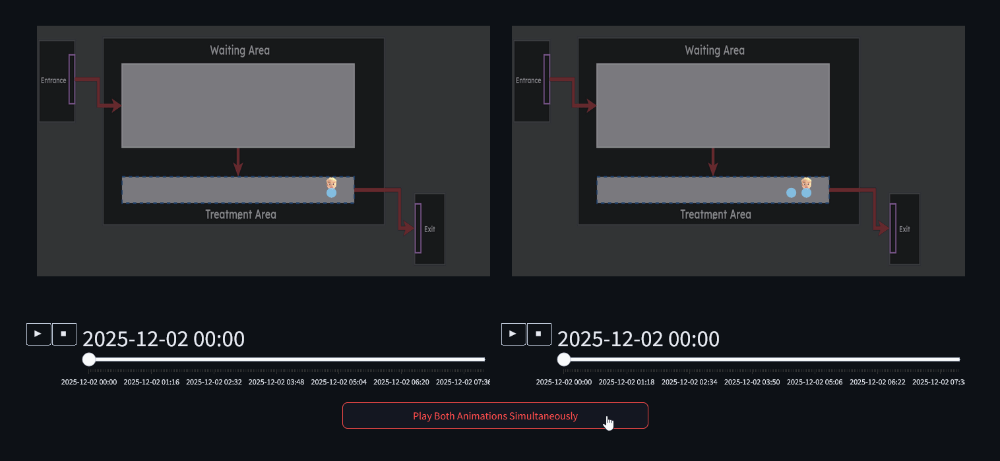
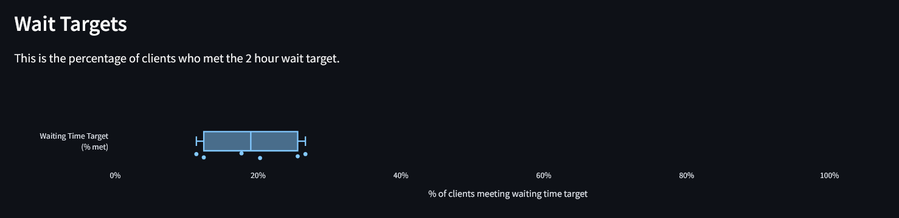
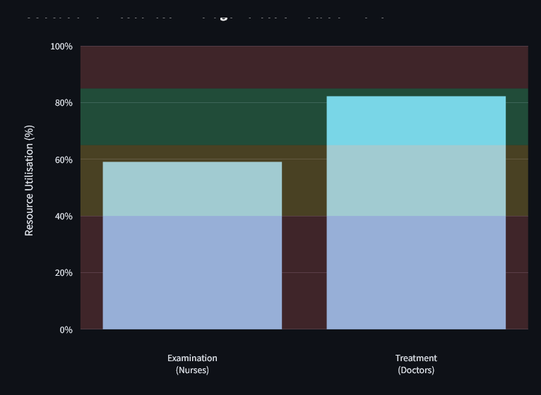
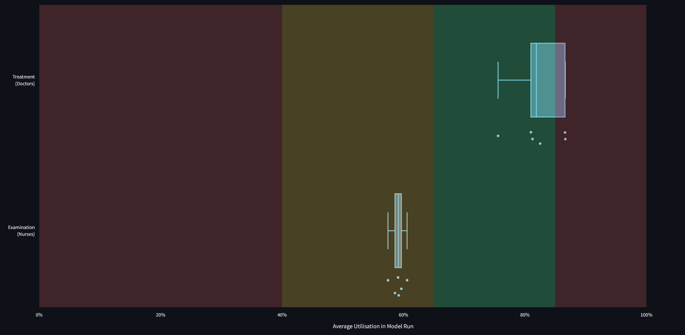
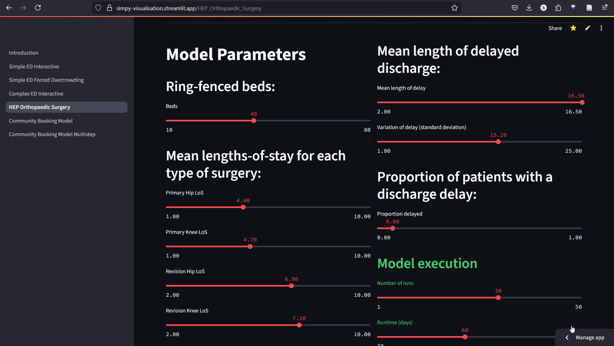
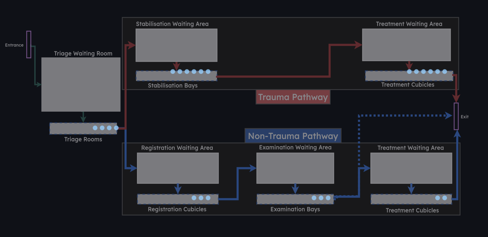
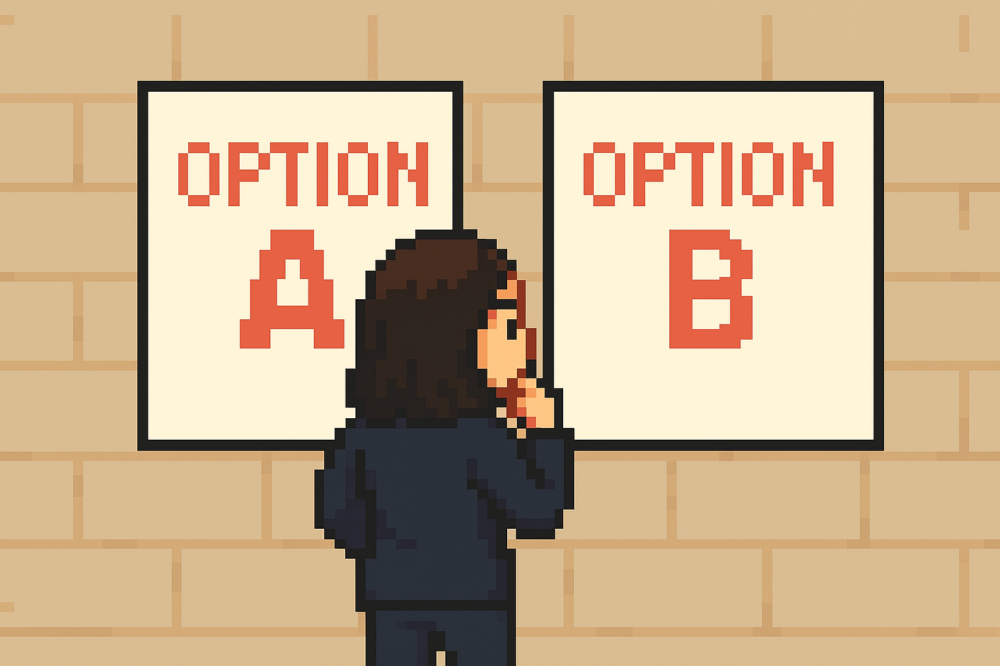
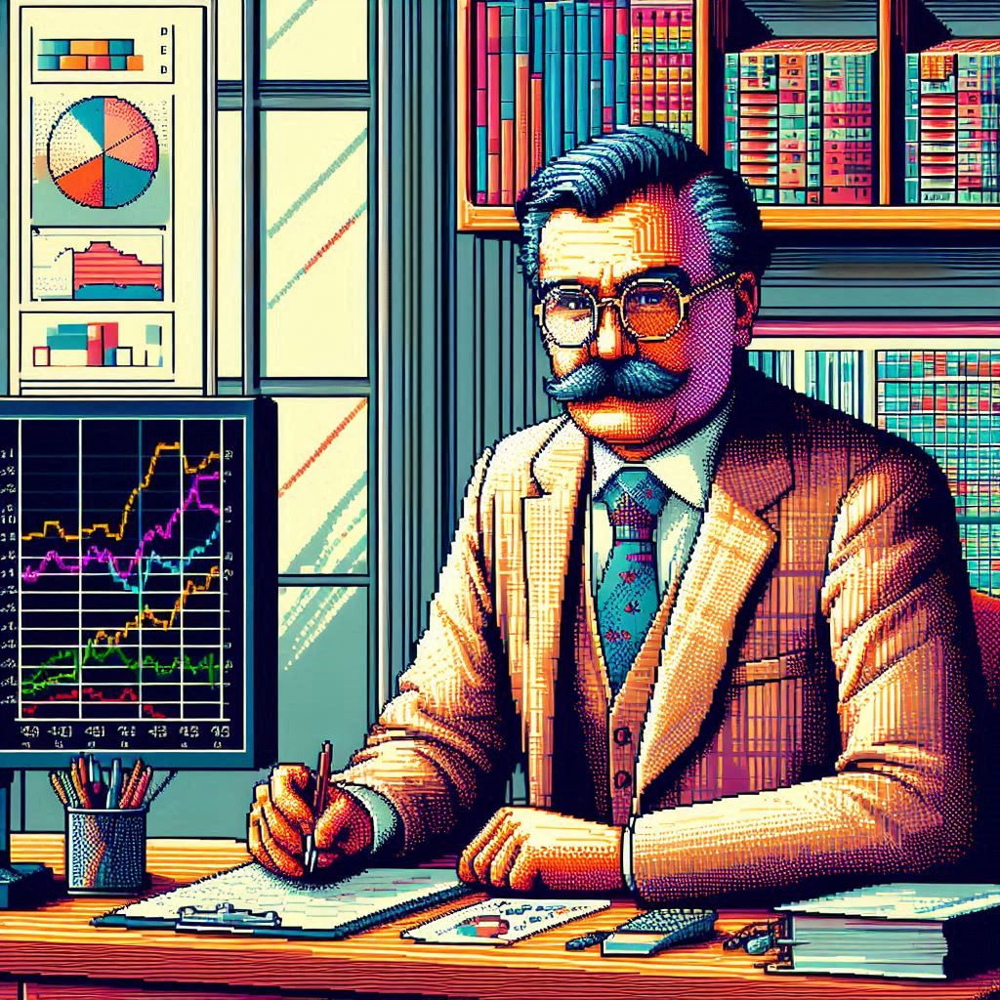
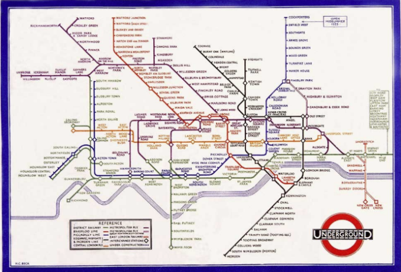
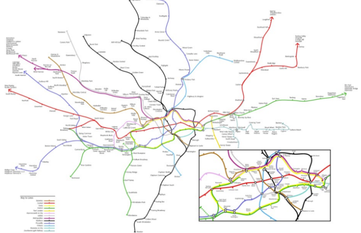

```{python}
#| echo: false

from vidigi.logging import EventLogger
from vidigi.utils import EventPosition, create_event_position_df
from vidigi.animation import animate_activity_log, generate_animation
from vidigi.prep import reshape_for_animations, generate_animation_df
import simpy
import numpy as np

import plotly.io as pio
pio.renderers.default = "notebook"
```

# Recap

So far we've talked about the different parts of a discrete event simulation.

But what if we could actually see the simulation panning out?

Let's revisit the key concepts.

## {#animationdemo-entities data-menu-title="Entities"}

Entities arrive in your system at varying rates

Entities are often the service users in your model.

Like buses, you might have none arrive for ages, then several at once.

```{python}
#| echo: false

```

## {#animationdemo-generators data-menu-title="Generators"}

Generators bring entities into being, and sinks take entities out of being.

And we might have multiple generators for different kinds of patients, if they arrive at different rates.

```{python}
#| echo: false

```


## {#animationdemo-entitypaths data-menu-title="Entity Paths"}

Our entities might take a range of different routes through the system.

```{python}
#| echo: false

```

## {#animationdemo-queueing data-menu-title="Queueing and Prioritisation"}

Queues might be seen in the order they arrive - or you may use priority-based queueing.

```{python}
#| echo: false

```

# The Power of Animations

We've demonstrated a few simple animations here to help recap the concepts.

Each animation is actually a **real discrete event simulation** running under the hood, using real simulation code.

But these animations aren't just limited to toy examples - they can be applied to real simulations too!

## From an emergency department...

```{python}
#| echo: false

```

:::{.notes}
Mention that here we are also showing having multiple different resource pools
:::

## To multi-clinic booking systems...

```{python}
#| echo: false

```

## To a ward...

```{python}
#| echo: false

```

# What-if Scenarios


## The Power of Questions

There are some key kinds of questions you can ask using a DES:

What happens if

:::: {.columns}

::: {.column width='50%'}

:::{.incremental}
- we **add** or **remove** resources?
  - what about at certain times of day?
  - or if we change the timing and overlap of different shifts?
- we **reorder** the process?
- we **add an extra step** to the process?
:::


:::

::: {.column width='50%'}

:::{.incremental}
- **demand increases** or **decreases**?
- parts of the process get **faster** or **slower**?
- we change how the queue is **prioritised**?
- the **patient characteristics change**?
:::

:::

::::


## And how animations can help you understand the answer to your questions



# Other DES Outputs

Animations can help you understand what's going on - but they're not so good at summarising the answers to your what-if questions.

## Wait Times

A common thing to measure is the **wait time** for key points in the service.

:::{.incremental}
- The **mean average** wait time
- The **median average** wait time
- The **maximum** wait time
- The **variation** in wait times (across day/week/seasons or across different cate)
:::

## Discussion

That gives you one idea for what you might measure in a model.

But what other sorts of things might you want to be tracking and discussing?

**Discuss in your groups for 5 minutes**

We'll then put some answers up on the board.

## Meeting wait targets

Rather than looking purely at the raw wait times, we might be interested in meeting targets.

For example: what % of people waited more than 4 hours?




## Queue Lengths

We might also be interested in

- the average lengths of queues
- how queues vary across
  - different resources/parts of the process
  - different times of day/days of the week/months of the year


## Resource Utilisation

We may also be interested in **resource utilisation**.

If our waits are good, but most of the time our resources are sitting idle, this is not optimal...

**But what is the ideal level of resource utilisation?**

:::{.fragment}

We often don't want all our resources being utilised 100% of the time - they'll burn out!

Or if we have a ward, we might not want it running at 100% occupancy so that there's space for emergency admissions.

:::

:::{.notes}
Talk a bit here about variability - the impact of not having spare capacity in your ward when someone then arrives needing seeing urgently
:::

## Cost Savings

*show something that can show the range of potential cost savings*

*Screenshot from the stroke model outputs?*

## And more!

:::{.incremental}
- Resources being blocked from use by a downstream resource limitation
  - e.g. ambulances being blocked from unloading patients
- Patients reneging or baulking
- Balance between admissions and discharges
- Throughput
  - patients treated per day
:::


# Visualising Metrics

Let's look at a couple of key ways you might see these sorts of things displayed in models.

## Bar Plots

Bar plots can be a good way of summarising the outputs of **multiple runs**



## Box Plots

Box plots can help us understand how things can vary **across runs**



## Line Charts

Line charts can be good for helping us understand how things vary **over time**

```{python}

```


## Histograms

Histograms are another good tool for understanding **variation**


# Interacting with Models

## The Code

Here's a sample of some code for a simulation model

```{python}
#| eval: false
#| echo: true



```

## Running the Code

:::: {.columns}

::: {.column width='25%'}

:::{.incremental .smaller}
- Ask IT for approval to install **Python**
- Install the additional packages into an **environment**
:::

:::

::: {.column width='75%'}

:::{.fragment}
Run it from the **terminal**...


:::

:::

::::


# Web App Interfaces

##  {#webappdemo-basic data-menu-title="An Example Web App"}

```{stlite-python}

```

:::{.notes}
- Linking this back to Dan's information on distributions
  - Mention that the defaults for the average new patients per week might have been set by our analysts based on the historical data that they have looked at
  - And they may have chosen a particular distribution based on the historical data too

DEMO
- Default parameters
  - make sure to look at all tabs
- Adding an extra clinician
- Changing back to 4 clinicians, and
:::

## Streamlit

:::: {.columns}

::: {.column width='40%'}

:::{.incremental}

- Free Python-based web app framework

- App users don't have to install Python

- Hosting
  - free online hosting
  - on-premisis hosting
  - browser-based running

- Alternatives exit (Shiny, Plotly Dash)

:::

:::

::: {.column width='60%'}

:::{.fragment}

<iframe data-src="https://webapps.hsma.co.uk/warnings_errors_success_messages.html" style="width:100%; height:600px;"></iframe>

:::

:::

::::

:::{.notes}
This is a topic we teach on HSMA

Streamlit could be applied to a wide range of problems - not just DES
:::

## Introducing Variability

##  {#webappdemo-multiple-runs data-menu-title="An Example Web App - Multiple Runs"}

```{stlite-python}

```


## Comparing scenarios

##  {#webappdemo-multiple-runs-scenario-comparison data-menu-title="An Example Web App - Comparing Scenarios"}

```{stlite-python}

```


## Animations

{height="650px"}

# Exercise: The DES Playground

## The Playground {.smaller}

You're now going to have a go with an interactive app.

In the app, you are running an emergency department. You usually have 24 cubicles available, which are **strictly divided** between two pathways and multiple steps.

{height=500px}


## The Exercise

With 24 rooms, your system is coping. However, due to building work, you are temporarily going to have 20 rooms available.

You need to reallocate the number of rooms available to different steps of the pathway - but is it possible to keep the hospital running smoothly still?

1. Run the simulation with the default parameters. What results does it give you?

2. Change some parameters and run it again. How do the results change?

3. Try to meet the goals!

## Discussion

<iframe data-src="https://hsma-programme.github.io/lambda_des_playground/" style="width:100%; height:650px;"></iframe>

# How to Make a Good Model

:::{.fragment}

A model is doomed to fail if it's not designed well.

So how can you help ensure that you are enabling your analysts to make good models?

:::

## Understanding the Process {.smaller}

What is the process - *really*?

:::: {.columns}

::: {.column width='67%'}


:::{.incremental}

- You're setting the model up for failure if you don't have the experts in the process in the room from the start

- Even then, it can be complex to work out what to model and what to simplify
  - But the scenarios you want to test can really influence this!

- And do you actually hold the data you need to parameterise the model?
  - Expert opinions can be used where data is missing, but this needs to be documented!
:::

:::

::: {.column width='30%'}

{height="500px"}

:::

::::


## Measuring Up

:::: {.columns}

:::{.fragment}

::: {.column width='45%'}

- From the beginning, you need to be thinking about what metrics/KPIs do you want to be able to measure

:::{.fragment}

- How are you going to measure that the model reflects the current reality?

:::

:::

::: {.column width='10%'}

:::

::: {.column width='45%'}


:::

:::

::::


## Scenarios {.smaller}

:::: {.columns}

::: {.column width='40%'}



:::

::: {.column width='40%'}
- What do you need to be able to change?

:::{.fragment}

- Will the simplified model logic support the scenarios you want to test?

:::

:::{.fragment}
- How do you want to be able to compare scenarios?
  - looking in-depth at scenarios one at a time?
  - or displaying outputs side-by-side in a web app?
:::

:::

::::


:::{.notes}

You can't just want to be able to change everything

Testing needs to be done to make sure that the outputs are sensible

:::

## Using it for decisions

:::: {.columns}

::: {.column width='50%'}

- What do you need to be able to export?

:::{.fragment}

- Is this a one and done output, or an ongoing tool?

:::

:::{.fragment}

- How do you assess that it made good predictions, and refine it?

:::

:::

::: {.column width='50%'}

{height="600px"}

:::

::::

## Understanding the limits

:::: {.columns}

::: {.column width='50%'}

A model is not a crystal ball!

:::

::: {.column width='50%'}

{height="600px"}

:::

::::


:::{.notes}
Caution against taking the outputs of what the model says as a perfectly accurate representation of what will definitely happen

Compare with weather forecasts

Or the models people use to inform the odds used by bookmakers

And bring it back to the inherent variability - which we do then try to capture in our models
:::

## Model Detail and Scope

:::: {.columns}

::: {.column width='50%'}

:::

::: {.column width='50%'}

"All models are wrong, but some are useful."

- George E.P. Box

(a British Statistician considered one of the greatest statistical minds of the 20th century)

:::

::::

## Model Detail and Scope (continued)

:::: {.columns}

::: {.column width='50%'}

### Tube Map

This model is wrong...



:::

::: {.column width='50%'}

:::{.fragment}

### Actual Layout



but very useful!

:::

:::

::::

## Model Simplifications

All models are built on assumptions and simplifications.

:::: {.columns}

::: {.column width='50%'}

Assumptions are things we have to assume because we don’t or can’t know something

:::

::: {.column width='50%'}

Simplifications are things in a model which we choose to represent in less detail than the real world equivalent because we don’t believe that added detail will give us added benefit.

:::

::::

:::{.fragment}

::: {.callout-tip appearance="minimal"}

As models are essentially collections of assumptions and simplifications...

--> the more of the real world we choose to capture...

--> the more potential inaccuracy we introduce!

:::

:::

## Scope and Detail

When designing a model, the modeller needs to consider scope and level of detail.

:::: {.columns}

::: {.column width='50%'}

**Scope** determines which section of the real world is carved out and represented in the model - where are the boundaries?

:::

::: {.column width='50%'}

**Level of detail** is how much of the real world detail is represented vs simplified

:::

::::

:::{.callout-tip }
### A good rule of thumb
Build the simplest model to sufficiently answer the question for which the model is being used

If extra scope or detail is needed, how can its representation be simplified?
:::


## How soon do you need it?

How long does a model take?

:::: {.columns}

::: {.column width='40%'}

:::{.fragment}

{height="600px"}

:::

:::

::: {.column width='60%'}

:::{.incremental}
- A good model can take time to create
  - it's not quite like a regular analysis
- You can help it go faster by carefully considering the things on the preceding slides
- Set your analysts up for success!
- A rushed model can do more harm than good
:::


:::

::::

## No, really, how long?

:::{.incremental .smaller}
- A simple model can go together pretty quickly (hours to days)
  - but your analysts may need time to upskill in R or Python...
  - and upskill in DES-specific concepts...
  - and add in a Streamlit frontend...
  - and clear visuals...
  - and animations...
  - and more complex inputs and scenarios...
  - and the ability to compare things side-by-side...
  - and the ability to download a summary table...
  - and robust tests...

:::


## There's more?

:::{.incremental}
  - and conform with the [20-item best-practice guidance on model reporting](https://des.hsma.co.uk/stress_des.html) and the [7 essential components and 5 optional components of the STARS reproducibility framework](https://des.hsma.co.uk/stars.html)...
:::

:::{.fragment}

:::{.callout-tip}

In reality, a good model may take weeks to months - and may be iterated on for years

But the time and effort can be worth it!

:::

:::


## A classic HSMA Quote

> "I can give you an answer by this afternoon that’s probably wrong and you’ll probably have to ask me again next week.
>
> Or I can build a model, which will take a bit longer, but you’ll probably never need to ask me that question again."

- One of our HSMAs from 2016 to their senior managers

# Exercise: Design your own Discrete Event Simulation + Interface

We're going to take your model ideas from earlier and design a web app interface to go with them.

## What can these web apps contain?

```{stlite-python}

```

## And what can they output?

*Text, metric cards, static plots, interactive plots, maps, downloadable reports*


## Your Task

Choose a system to model
  - it could be the one you discussed earlier
  - or you can choose something different

Using the provided paper and markers, you are going to draw some **wireframes** (mock-ups) of a web application front-end for your system.

Think about the kinds of **inputs** and **outputs** you want in your model.
