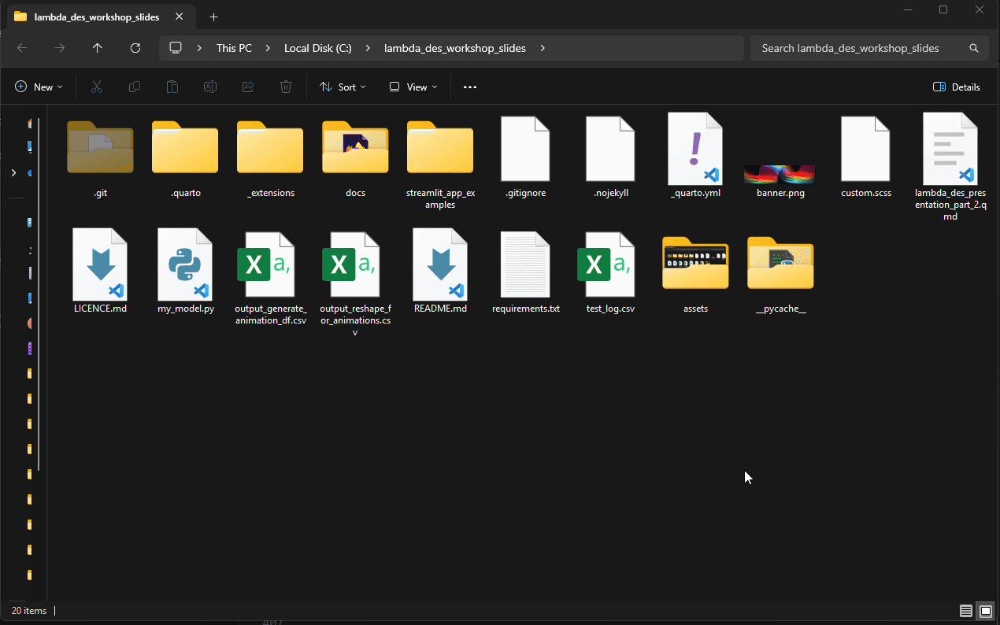

```{python}
#| echo: false

from vidigi.logging import EventLogger
from vidigi.utils import EventPosition, create_event_position_df
from vidigi.animation import animate_activity_log, generate_animation
from vidigi.prep import reshape_for_animations, generate_animation_df
import simpy
import numpy as np

import plotly.io as pio
pio.renderers.default = "notebook"
```

# Recap

So far we've talked about the different parts of a discrete event simulation.

But what if we could actually see the simulation panning out?

Let's revisit the key concepts.

## Entities arrive in your system...
Entities are often the service users in your model.

```{python}
#| echo: false

```

## ... at varying rates...

Like buses, you might have none arrive for ages, then several at once.

```{python}
#| echo: false

```

## ... and spend varying amounts of time in the system

```{python}
#| echo: false

```


## Entities might go off and do different things in our model...

```{python}
#| echo: false

```

## Or they might do things in a sequence...

```{python}
#| echo: false

```


## Or they might take a range of different routes through the system...

```{python}
#| echo: false

```

## Generators bring entities into being...

And we might have multiple generators for different kinds of patients, if they arrive at different rates.

```{python}
#| echo: false

```


## And sinks take entities out of being!

```{python}
#| echo: false

```

## Activities and Resources

```{python}
#| echo: false

```

## Multiple Resources

```{python}
#| echo: false

```


## FIFO Queues

In the queues we've seen so far, the sooner you arrive, the sooner you are seen.

```{python}
#| echo: false

```

## Priority-based Queue

But it's also possible to have priority-based queueing.

```{python}
#| echo: false

```

## Reneging


## Balking


## Multiple Resource Pools


## Multiple Resource Pools


## Jockeying


# The Power of Animations

We've demonstrated a few simple animations here to help recap the concepts.

Each animation is actually a real discrete event simulation running under the hood, using real simulation code.

But these animations aren't just limited to toy examples - they can be applied to real simulations too!

## From an emergency department...

## To a community-based appointment booking system...

## To a simple ward...

## To a complex ward with ringfenced beds and slot cancellation...


# What-if Scenarios


## The Power of Questions


## And how animations can help you understand the answer to your questions

Demonstrate two animations side-by-side

:::: {.columns}

::: {.column width='50%'}

## With 3 cubicles

:::

::: {.column width='50%'}

## With 4 cubicles

:::

::::


# Interacting with Models

## The Code

Here's a sample of some code for a simulation model

```{python}
#| eval: false
#| echo: true



```

## Running the Code

:::: {.columns}

::: {.column width='25%'}

:::{.incremental .smaller}
- Ask IT for approval to install **Python**
- Install the additional packages into an **environment**
:::

:::

::: {.column width='75%'}

:::{.fragment}
Run it from the **terminal**...


:::

:::

::::


# Web App Interfaces

##  {#webappdemo-basic data-menu-title="An Example Web App"}

```{stlite-python}

```

## Streamlit

:::: {.columns}

::: {.column width='40%'}

:::{.incremental}

- Free Python-based web app framework

- App users don't have to install Python

- Hosting
  - free online hosting
  - on-premisis hosting
  - browser-based running

- Alternatives exit (Shiny, Dash)

:::

:::

::: {.column width='60%'}

:::{.fragment}

<iframe data-src="https://webapps.hsma.co.uk/warnings_errors_success_messages.html" style="width:100%; height:700px;"></iframe>

:::

:::

::::

## Making our app more useful

Let's return to our sample web app.

We'll add

- some extra inputs
- some analysis of the patient wait times

##  {#webappdemo-intermediate-1 data-menu-title="An Example Web App - Additional Parameters and Outputs"}

```{stlite-python}

```

:::{.notes}
Are we seeing the full picture here?

'wait times' too vague.
:::

##  {#webappdemo-intermediate-2 data-menu-title="An Example Web App - Better Outputs"}

Let's make it clearer what the wait times mean.

```{stlite-python}

```

## Introducing Variability


##  {#webappdemo-multiple-runs data-menu-title="An Example Web App - Multiple Runs"}

```{stlite-python}

```


## Comparing scenarios

##  {#webappdemo-multiple-runs-scenario-comparison data-menu-title="An Example Web App - Comparing Scenarios"}

```{stlite-python}

```


## Animations

*DEMO  incorporating animations into a streamlit web app interface*

# Exercise: The DES Playground

You're now going to have a go with an interactive app.

In the app, you are running a hospital.

You usually have 24 rooms available, which are divided between

With 24 rooms, your system is coping.

Due to building work, you are temporarily going to have 20 rooms available.

You need to reallocate the number of rooms available to different steps of the pathway - but is it possible to keep the hospital running smoothly still?

1. Run the simulation with the default parameters

2. Change some parameters and run it again. How do the results change?

3. Try to meet all of the goals!

Afterwards, we'll regroup and discuss the following:
- What combination allowed you to achieve the target?
- What do you like about this app?
- What would you want to change?

# How to Make a Useless Model

## ... and How to Avoid that.

:::{.fragment}

A model is only as good as it's spec.

:::

## Understanding the Process

What is the process - *really*?

:::: {.columns}

::: {.column width='67%'}

:::{.incremental}

- You're setting the model up for failure if you don't have the experts in the process in the room from the start

- Even then, it can be complex to work out what to model and what to simplify (and the scenarios you want to test can really influence this)

- And do you actually hold the data you need to parameterise the model?
  - Expert opinions can be used where data is missing, but this needs to be documented!
:::

:::

::: {.column width='30%'}

{height="500px"}

:::

::::


## Measuring Up

:::: {.columns}

:::{.fragment}

::: {.column width='45%'}

- What metrics/KPIs do you want to be able to measure?

:::{.fragment}

- How are you going to measure that the model reflects the current reality?

:::

:::

::: {.column width='10%'}

:::

::: {.column width='45%'}


:::

:::

::::


## Scenarios

:::: {.columns}

::: {.column width='50%'}


:::

::: {.column width='50%'}
- What do you need to be able to change?

:::{.fragment}

- Will the simplified model logic support the scenarios you want to test?

:::

:::

::::


:::{.notes}

You can't just want to be able to change everything

Testing needs to be done to make sure that the outputs are sensible

:::

## Using it for decisions

:::: {.columns}

::: {.column width='50%'}

- What do you need to be able to export?

:::{.fragment}

- Is this a one and done output, or an ongoing tool?

:::

:::{.fragment}

- How do you assess that it made good predictions, and refine it?

:::

:::

::: {.column width='50%'}

{height="600px"}

:::

::::


## How soon do you need it?

How long does a model take?

:::: {.columns}

::: {.column width='40%'}

:::{.fragment}

{height="600px"}

:::

:::

::: {.column width='60%'}

:::{.incremental}
- A good model can take time to create
  - it's not quite like a regular analysis
- You can help it go faster by carefully considering the things on the preceding slides
- Set your analysts up for success!
- A rushed model can do more harm than good
:::


:::

::::


## No, really, how long?

:::{.incremental .smaller}
- A simple model can go together pretty quickly (hours to days)
  - but your analysts may need time to upskill in R or Python...
  - and upskill in DES-specific concepts...
  - and add in a Streamlit frontend...
  - and clear visuals...
  - and animations...
  - and more complex inputs and scenarios...
  - and the ability to compare things side-by-side...
  - and the ability to download a summary table...
  - and robust tests...

:::


## There's more?

:::{.incremental}
  - and conform with the [20-item best-practice guidance on model reporting](https://des.hsma.co.uk/stress_des.html) and the [7 essential components and 5 optional components of the STARS reproducibility framework](https://des.hsma.co.uk/stars.html)...
:::

:::{.fragment}

:::{.callout-tip}

In reality, a good model may take weeks to months - and may be iterated on for years

:::

:::

## Alternatives to FOSS


# Exercise: Design your own Discrete Event Simulation + Interface

We're going to take your model ideas from earlier and design a web app interface to go with them.

## What can these web apps contain?

```{stlite-python}

```

## And what can they output?

Text, metric cards, static plots, interactive plots, maps, downloadable reports


## Your Task


Could get them using something like draw.io or Excalidraw?

Choose a system to model from a couple of suggestions (choose some things that are quite simple), or do one of their own systems from their post-it notes earlier.
